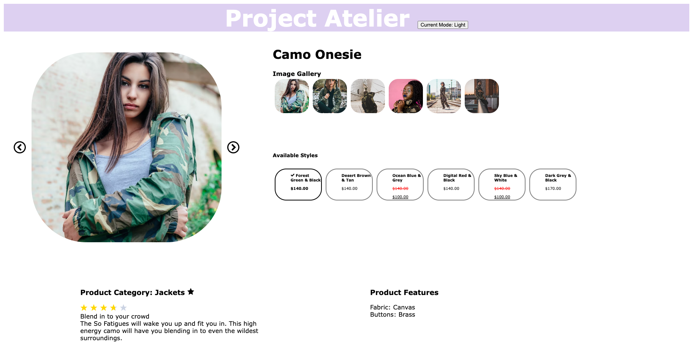
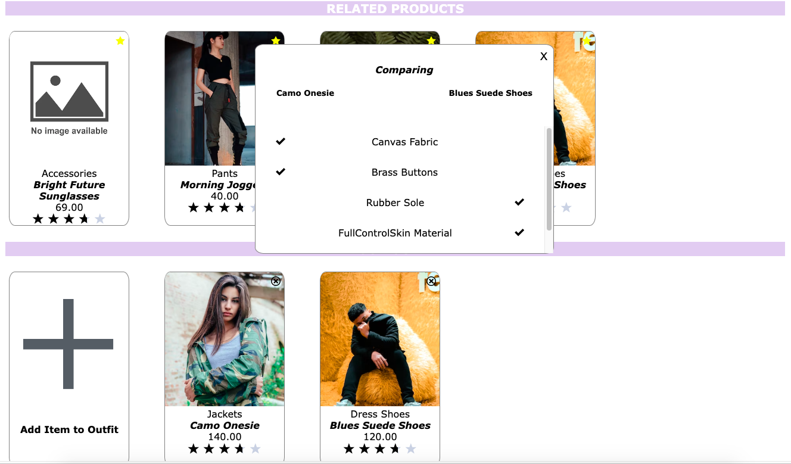
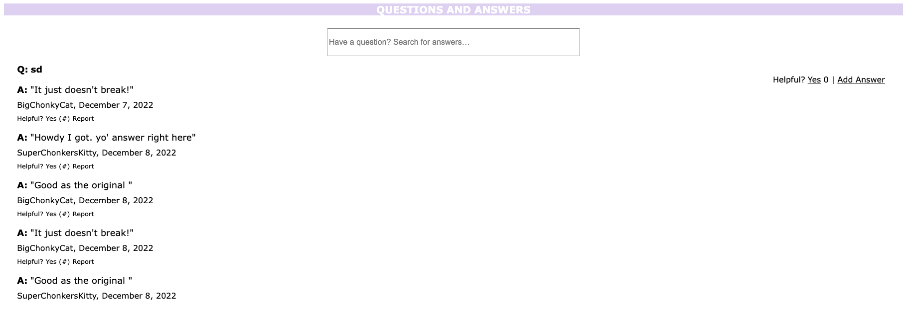
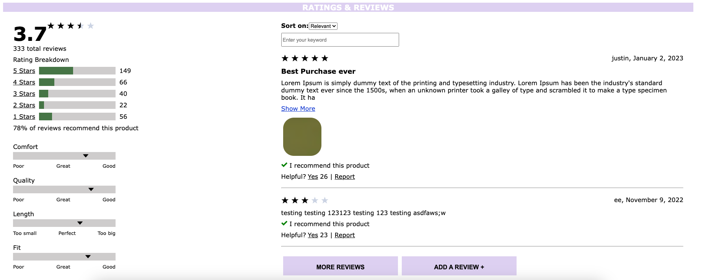

# FEC (Front End Capstone) Atelier
## *To design a product detail page for a clothing company*

 

##  Team Boson
- Guillermo Hasbun (Overview)
- Maddie Sime (Related)
- Fig Fishkin (Questions and Answers)
- Harry Meng (Ratings & Reviews)

 

## Four Widgets
1. **Overview**

    Product overview is the first widget that appears on the page. It displays the main product info for the currently selected product, as well as the styles available, and the pictures of the current styles. The star button allows the current product to be added to the outfit carousel. The main images scroll in loop, and the gallery has a scroll for more than 7 images. The styles show the sale price, and have a red strikethrough for discounted items.

    

 

2. **Related Products**

    The Related Products widget showcases all products that are related to the current product. If the amount of related products doesn’t fit on the screen, it is displayed in a carousel fashion to allow for scrolling. The same functionality applies to the “Your Outfit” section, where the user can build unique outfits by clicking the “Add Item to Outfit” button (or the star button in the Overview section). Clicking on the star button on a related product card brings up a comparison modal, which compares the characteristics for the current product and the product that was clicked on.

    
 

3. **Questions & Answers**

    QA summary: Questions and Answers displays questions asked by customers and potential customers. It also displays answers submitted by site users. Users can enter a search term, and the widget will display only questions and answers which contain the entered term. Site users can select if they find the question helpful, and the number of users who have previously selected they found the question helpful is displayed. Each question offers the option for users to add an answer. For each individual answer, users can select if they found it helpful and see how many other users found it helpful. The nickname for the author of the answer appears below the answer along with the date it was posted. Users also have the option to report the answer, marking it for review by an administrator.

    
 

4. **Ratings & Reviews**

   Ratings & Reviews is the last widget, and it allows viewing and submission of reviews for the product selected. It displays the average rating score for the selected product, as well as the number of reviews for 1-5 stars evaluation. The grey bars shows the user comment for product's characteristics, include size, width, comfort, quality, length and fit. You can filter the reviews easily by selecting stars option, sorting dropdown menu and search bar as well to find their needed information quickly, and submit a new review by clicking the button at the bottom.

    

 

## Setup Instructions:
1. Clone the repo in your local machine
2. Obtain a GitHub token
3. Open the repo in VS Code
4. Run npm install
5. Create a .env file
6. Add the Token to the file
7. Open two terminals on VS Code
8. Run npm run react-dev on one terminal
9. Run npm run server-dev on the other terminal
10. Open http://localhost:3000/ on browser.

 

## Testing
The repo uses Jest to test the components, and checks the app coverage for optimal performance. Jest also uses a react testing environment to create a render, which allows us to feed the test data, and check the output.

 

## The spring in phases
- Phase 0
  > During this phase, we each were randomly assigned our app widgets. Guillermo Hasbun was assigned Product Overview, Harry Meng was assigned Ratings, Fig Fishkin was assigned Q&A, and Maddie Sime was assigned Related. The main portion of Phase 0 was spent delegating our duties as a team via the Business Requirements Document, and setting community standards for each team member to follow. We worked on understanding our Git Workflow, and created engineering journals to help keep track of our coding time and reflections.

- Phase 1
  >  During this phase, we worked on our widget layouts and components. We began utilizing Trello more often to write tickets to render our app components, as well as structure our components in a cleaner organization style. Working on our branches as a group proved to be rocky at first, but communication was key to keeping us on track. This phase allowed each group member the ability to work on their respective component independently, but also ask for assistance for bugs and general guidance.

- Phase 2
  > During phase 2, we continued working on implementing the functionality of our widgets. We continued to utilize and update Trello and continued to strengthen our Git/Github workflow skills. We got some exposure to Chrome DevTools' Lighthouse tool which allowed us to assess multiple aspects of our application's performance. For those of us who have widgets that require information from our teammate's widgets, we began to communicate around how we will accomplish gaining access to that information. Overall, we dove deeper into the requirements of our widgets and continued to work as a team.

- Phase 3
  > During phase 3, we continued working on the functionality and styling for our widgets, and began to add unit/integration test suite to cross check the app. Then we deployed the app to Amazon Web Service (AWS), therefore it could be viewed publicly.

- Phase 4
  > During phase 4, we worked on the CSS properties together to make the app looks pretty and clean. There are two theme color, light and dark by clicking on the button to switch over. Ran the google page speed against the app, and implemented the optimizations, such as compress the files, remove duplicate API calls in the individual widget and etc. Tested the app in most popular browsers, Safari/Google Chrome/Firefox/Edge, and all work well.